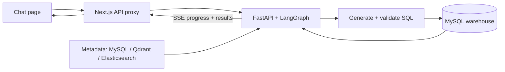

<h1 align="center">掌柜问数 · data-agent</h1>

<p align="center">Ask questions in Chinese. Get answers from your data warehouse.</p>

<p align="center">
  English |
  <a href="./README_zh.md">简体中文</a>
</p>

<p align="center">
  
  
  
  
  
  <a href="./LICENSE"></a>
</p>

## Overview

data-agent is a natural-language-to-SQL web application for querying a MySQL data warehouse without writing SQL by hand. It retrieves relevant schema, field values, and metric definitions, generates and validates a query, and displays the results in a chat interface with live progress updates.

The included retail dataset covers orders, customers, products, regions, and dates. The interface, business metadata, and agent prompts are in Chinese.

## Key Features

- **Chinese questions → SQL results:** query warehouse data from a single chat page.
- **Metadata retrieval:** combine semantic search for fields and metrics with full-text search for actual field values.
- **SQL validation and correction:** check generated SQL with MySQL `EXPLAIN` and attempt one correction when database validation fails.
- **Live progress and tables:** stream agent steps, results, and errors to the browser over SSE.
- **Configurable knowledge:** define table descriptions, field aliases, and metrics in YAML.

## Tech Stack

| Layer | Technologies |
| --- | --- |
| Frontend | Next.js App Router, React, TypeScript, CSS |
| Backend / Agent | FastAPI, LangGraph, LangChain, DeepSeek, SQLAlchemy + asyncmy |
| Data / Retrieval | MySQL, Qdrant, Elasticsearch, BGE embeddings via Hugging Face Text Embeddings Inference |
| Infrastructure | Docker Compose, uv, npm |
| Testing | pytest, Vitest, Testing Library, Playwright, GitHub Actions |

## Architecture



On first startup, the metadata knowledge base is built before the backend starts. See the [backend guide](backend/README.md) for the agent workflow and configuration.

## Quick Start

Requirements: Docker with Compose, `make`, and a DeepSeek API key. The Compose file currently uses an ARM64 CPU embedding image; other architectures may require a compatible image.

```bash
git clone https://github.com/limitless0163/data-agent.git
cd data-agent
cp .env.example .env
```

Set `DEEPSEEK_API_KEY` in `.env`, then start the stack:

```bash
make dev
```

On macOS, the command opens Docker Desktop if needed; on other systems, start Docker Engine first. The first run pulls images, downloads the embedding model, seeds MySQL, and builds the knowledge base. Use `make ps` or `make logs SERVICE=knowledge-init` to check startup progress.

Once ready, open [http://localhost:8080](http://localhost:8080) and ask, for example, `2025年各地区的销售总额是多少？` Run `make smoke` to check the frontend and backend HTTP path.

## Project Structure

```text
.
├── backend/            # FastAPI, agent, metadata builder, and backend tests
├── frontend/           # Next.js chat interface and frontend tests
├── infra/              # MySQL initialization and sample data
├── tests/e2e/          # Browser and cross-service tests
├── scripts/            # HTTP smoke checks
├── docs/               # Implementation notes and project conventions
├── docker-compose.yml  # Shared services and dev/prod profiles
└── Makefile            # Stack orchestration and test commands
```

## Development

Run these commands from the repository root:

| Command | Purpose |
| --- | --- |
| `make dev` | Build and start the development stack with frontend hot reload |
| `make prod` | Build and start the stack with the production frontend |
| `make stop` | Stop services, keeping containers and data volumes |
| `make ps` / `make logs` | Inspect service status / follow logs |
| `make smoke` | Check HTTP connectivity and request validation |
| `make typecheck` | Check TypeScript in the running `frontend-dev` container |
| `make test-install` / `make test` | Install native test dependencies / run all test layers |
| `make test-coverage` | Run all tests with backend and frontend coverage gates |
| `make help` | List available commands |

Native development and tests use Python 3.11.2, uv, Node 22.22.2+ (22.x), and npm. Automated tests use isolated substitutes for external services and need no real API credentials. CI runs coverage checks and a production frontend build on pushes and pull requests.

## Documentation

- [Frontend guide](frontend/README.md) — setup, routes, streaming, and tests.
- [Backend guide](backend/README.md) — workflow, API, configuration, and tests.
- [Implementation notes (Chinese)](docs/DATA-AGENT.md) — metadata knowledge base and agent internals.
- [Directory conventions](docs/ARCHITECTURE_INSTRUCTIONS.md) — repository organization.
- [Agent guidance](AGENTS.md) — repository orientation and module guides.

## License

This project is licensed under the [MIT License](LICENSE).
