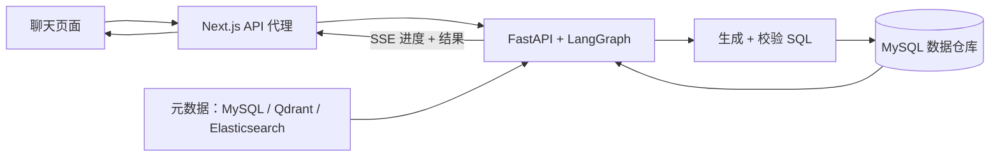

<h1 align="center">掌柜问数 · data-agent</h1>

<p align="center">用中文提问，从数据仓库获取答案。</p>

<p align="center">
  <a href="./README.md">English</a> |
  <a href="./README_zh.md">简体中文</a>
</p>

## 项目概述

data-agent 是一个将自然语言转换为 SQL 的 Web 应用，帮助用户无需手写 SQL 即可查询 MySQL 数据仓库。系统检索相关表结构、字段取值和指标定义，生成并校验查询，在聊天界面实时展示执行进度与结果。

项目内置零售示例数据，涵盖订单、客户、商品、地区和日期。界面、业务元数据和 Agent 提示词均使用中文。

## 核心功能

- **中文问题 → SQL 结果：** 在单个聊天页面查询数据仓库。
- **元数据检索：** 结合字段和指标的语义检索，以及实际字段取值的全文检索。
- **SQL 校验与校正：** 通过 MySQL `EXPLAIN` 检查生成的 SQL，数据库校验失败时尝试一次校正。
- **实时进度与表格：** 通过 SSE 向浏览器推送 Agent 步骤、结果和错误。
- **可配置知识库：** 使用 YAML 定义表描述、字段别名和指标。

## 技术栈

<p>
  
  
  
  
  
</p>

| 层级 | 技术 |
| --- | --- |
| 前端 | Next.js App Router、React、TypeScript、CSS |
| 后端 / Agent | FastAPI、LangGraph、LangChain、DeepSeek、SQLAlchemy + asyncmy |
| 数据 / 检索 | MySQL、Qdrant、Elasticsearch、通过 Hugging Face Text Embeddings Inference 提供的 BGE 向量服务 |
| 基础设施 | Docker Compose、uv、npm |
| 测试 | pytest、Vitest、Testing Library、Playwright、GitHub Actions |

## 系统架构



首次启动时先构建元数据知识库，再启动后端。Agent 工作流和配置详见[后端指南](backend/README.md)。

## 快速开始

前置条件：支持 Compose 的 Docker、`make` 和 DeepSeek API Key。Compose 文件目前使用 ARM64 CPU 向量服务镜像；其他架构可能需要替换为兼容镜像。

```bash
git clone https://github.com/limitless0163/data-agent.git
cd data-agent
cp .env.example .env
```

在 `.env` 中设置 `DEEPSEEK_API_KEY`，然后启动服务：

```bash
make dev
```

macOS 上命令会按需打开 Docker Desktop；其他系统请先启动 Docker Engine。首次运行会拉取镜像、下载向量模型、导入 MySQL 示例数据并构建知识库。使用 `make ps` 或 `make logs SERVICE=knowledge-init` 查看启动进度。

就绪后打开 [http://localhost:8080](http://localhost:8080)，例如提问：`2025年各地区的销售总额是多少？` 运行 `make smoke` 检查前后端 HTTP 链路。

## 项目结构

```text
.
├── backend/            # FastAPI、Agent、元数据构建与后端测试
├── frontend/           # Next.js 聊天界面与前端测试
├── infra/              # MySQL 初始化与示例数据
├── tests/e2e/          # 浏览器与跨服务测试
├── scripts/            # HTTP 冒烟检查
├── docs/               # 实现说明与项目规范
├── docker-compose.yml  # 共享服务与 dev/prod 配置
└── Makefile            # 服务编排与测试命令
```

## 开发

在仓库根目录运行以下命令：

| 命令 | 用途 |
| --- | --- |
| `make dev` | 构建并启动开发栈，支持前端热更新 |
| `make prod` | 构建并启动使用生产前端的服务栈 |
| `make stop` | 停止服务，保留容器和数据卷 |
| `make ps` / `make logs` | 查看服务状态 / 跟踪日志 |
| `make smoke` | 检查 HTTP 连通性和请求校验 |
| `make typecheck` | 在运行中的 `frontend-dev` 容器内检查 TypeScript |
| `make test-install` / `make test` | 安装原生测试依赖 / 运行全部测试层 |
| `make test-coverage` | 运行全部测试并执行前后端覆盖率门禁 |
| `make help` | 列出可用命令 |

原生开发与测试使用 Python 3.11.2、uv、Node 22.22.2+（22.x）和 npm。自动化测试使用隔离的外部服务替身，无需真实 API 密钥。CI 在 push 和 pull request 时执行覆盖率检查及前端生产构建。

## 文档

- [前端指南](frontend/README.md) — 环境搭建、路由、流式处理与测试。
- [后端指南](backend/README.md) — 工作流、API、配置与测试。
- [实现说明（中文）](docs/DATA-AGENT.md) — 元数据知识库与 Agent 内部实现。
- [目录规范](docs/ARCHITECTURE_INSTRUCTIONS.md) — 仓库组织方式。
- [Agent 协作指南](AGENTS.md) — 仓库概览与模块指南。
