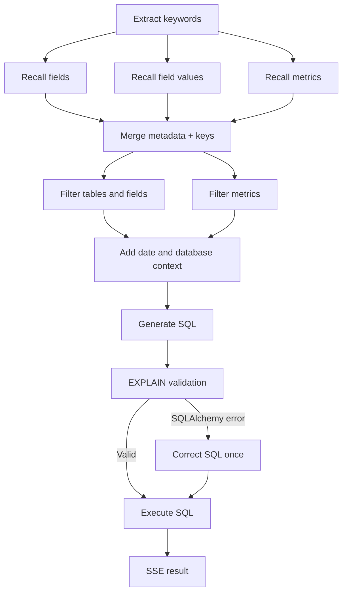

# Backend

The FastAPI backend converts Chinese questions into MySQL queries. A LangGraph workflow retrieves metadata, filters context, generates SQL, validates it with `EXPLAIN`, and streams progress and query results over SSE.

## Stack

| Area | Technology |
| --- | --- |
| Runtime / Dependencies | Python 3.11.2, uv, committed `uv.lock` |
| API | FastAPI, Pydantic, Uvicorn |
| Agent | LangGraph, LangChain, jieba, Markdown prompts |
| Model | DeepSeek; configured model `deepseek-flash` |
| Database | MySQL 8.4, SQLAlchemy 2.x async sessions, asyncmy |
| Retrieval | Qdrant, Elasticsearch 8, Hugging Face endpoint embeddings |
| Embeddings | `BAAI/bge-large-zh-v1.5`, 1024 dimensions |
| Configuration / Logging | OmegaConf, python-dotenv, loguru |
| Tests | pytest, pytest-asyncio, pytest-mock, pytest-cov, SQLite, in-memory Qdrant |

Dependency ranges are declared in [pyproject.toml](pyproject.toml); exact versions are in [uv.lock](uv.lock). Docker and CI use uv 0.12.17.

## Architecture

The API router receives a Pydantic request and obtains a `QueryService` through FastAPI dependencies. That service runs the compiled graph with fresh state and dependency context for each question, encoding custom graph events as SSE frames. Client managers are initialized by the application lifespan; MySQL sessions are scoped to requests.



Fields and metrics use Qdrant semantic search; field values use Elasticsearch full-text search. Metadata from MySQL adds metric dependencies and primary/foreign keys before LLM filtering. Relative dates use `Asia/Shanghai`.

Validation handles SQLAlchemy errors by attempting **one** correction. Corrected SQL goes directly to execution; there is no second validation or retry loop. Other graph failures become SSE error events. Prompts request read-only SQL, but the repository does not enforce a SQL allowlist and the bundled MySQL user has write privileges. Query results are fetched in full and sent in a single result event.

## Setup and Running

For the complete application, follow the [root quick start](../README.md#quick-start). Compose initializes MySQL and builds the knowledge base before starting the API. The backend listens on container port `8000`, accessible through the frontend at [http://localhost:8080](http://localhost:8080); it has no host port mapping.

For native development, use **Python 3.11.2** (pinned in `.python-version`) and uv. Provide reachable MySQL, Elasticsearch, Qdrant, and embedding services. MySQL must have the `meta` schema and `dw` tables; the bundled initialization and sample data are in [../infra/docker/mysql/init.sql](../infra/docker/mysql/init.sql).

From the repository root:

```bash
cd backend
uv sync --frozen
```

Set connection details as described below and provide a DeepSeek API key through the root `.env` or environment. With an empty metadata database and fresh retrieval stores, build the knowledge base once:

```bash
uv run --frozen python -m scripts.build_meta_knowledge --conf app/core/config/meta_config.yaml
```

Then start the API with reload:

```bash
uv run --frozen uvicorn app.main:app --host 127.0.0.1 --port 8000 --reload
```

The native API is available at [http://localhost:8000](http://localhost:8000), with FastAPI docs at [http://localhost:8000/docs](http://localhost:8000/docs).

Compose does not mount backend source or enable reload. After backend code or YAML changes, run root `make dev` or `make prod` to rebuild the image and recreate the service. A container restart alone does not load changed host files. Metadata edits also require rebuilding knowledge data as described below.

## Configuration

[app/core/config/app_config.py](app/core/config/app_config.py) loads the root `.env` without replacing existing environment variables, reads `app_config.yaml`, applies supported overrides, and validates the result against dataclasses. Keep real secrets outside tracked YAML.

| Setting | Native YAML default | Compose setting |
| --- | --- | --- |
| Metadata / Warehouse MySQL | `localhost:3306`, databases `meta` / `dw` | `mysql:3306`; host mapping `3307:3306` |
| Qdrant | `localhost:6333`, dimension 1024 | `qdrant:6333` |
| Elasticsearch | `localhost:9200` | `elasticsearch:9200` |
| Embeddings | `localhost:8081` | `embeddings:80` |
| LLM | `deepseek-flash`, base URL `https://api.deepseek.com` | Same YAML settings, API key injected |

Only MySQL is published to the host among these Compose dependency services. Native runs need independently reachable endpoints; the Compose service names are resolved inside its network.

Supported environment overrides:

| Variables | Fields overridden |
| --- | --- |
| `DATA_AGENT_DB_META_HOST`, `DATA_AGENT_DB_META_PORT` | Metadata database host and port |
| `DATA_AGENT_DB_DW_HOST`, `DATA_AGENT_DB_DW_PORT` | Warehouse database host and port |
| `DATA_AGENT_DB_USER`, `DATA_AGENT_DB_PASSWORD` | User and password for both databases |
| `DATA_AGENT_QDRANT_HOST`, `DATA_AGENT_QDRANT_PORT` | Vector service endpoint |
| `DATA_AGENT_EMBEDDING_HOST`, `DATA_AGENT_EMBEDDING_PORT` | Embedding service endpoint |
| `DATA_AGENT_ES_HOST`, `DATA_AGENT_ES_PORT` | Search service endpoint |
| `DATA_AGENT_LLM_API_KEY` / `DEEPSEEK_API_KEY` | LLM key; the former takes precedence |

Compose requires `DEEPSEEK_API_KEY` and also supports `MYSQL_ROOT_PASSWORD` and `DATA_AGENT_DB_PASSWORD`, with defaults defined in `docker-compose.yml`. Database names, model settings, vector size, and logging settings are configured in YAML.

### Metadata Knowledge Base

[app/core/config/meta_config.yaml](app/core/config/meta_config.yaml) defines table roles/descriptions, field roles/aliases, value synchronization flags, and metric descriptions/dependencies. The builder reads actual column types and example values from the warehouse, then writes:

- MySQL `meta`: `table_info`, `column_info`, `metric_info`, and `column_metric`.
- Qdrant: `data-agent-column` and `data-agent-metric`, using 1024-dimensional cosine vectors for names, descriptions, and aliases.
- Elasticsearch: `data-agent-value`, indexing distinct values only for `sync: true` columns.

The Elasticsearch index name is defined by the repository; `es.index_name` in YAML is not used for the value index. Changing the embedding model requires matching vector dimensions and collections.

The build inserts metadata records; it is **not an idempotent update** and writes are not atomic across stores. Rebuilding requires clearing existing knowledge records and indexes as well as the Compose readiness marker. Removing only the marker can cause duplicate-key failures. The builder provides no cleanup or migration command.

Compose's `knowledge-init` skips building when `/state/ready` exists in the `knowledge_state` volume. Its wait script uses Compose DNS names for Elasticsearch, Qdrant, and embeddings and checks for seeded `fact_order` data, with a 15-minute timeout. For native endpoints, use the direct build command above after confirming service readiness.

## API

`POST /api/query` accepts a required string field:

```json
{ "query": "2025年各地区的销售总额是多少？" }
```

Missing or incorrectly typed fields return HTTP `422`. The backend accepts empty strings; the frontend blocks blank submissions. A valid request returns `text/event-stream`, with frames separated by a blank line:

```text
data: {"type":"progress","step":"抽取关键字","status":"running"}

data: {"type":"progress","step":"抽取关键字","status":"success"}

```

| Event | Fields |
| --- | --- |
| `progress` | `step: string`, `status: "running" \| "success" \| "error"` |
| `result` | `data: Record<string, unknown>[]` |
| `error` | `message: string` |

Graph errors after streaming begins are delivered as `error` events. Serialization uses `ensure_ascii=False` and `default=str`, so values such as `Decimal` and dates become strings.

Query through the Compose frontend proxy (also works with a native backend by using port `8000`):

```bash
curl -N -H 'Content-Type: application/json' \
  -d '{"query":"2025年各地区的销售总额是多少？"}' \
  http://localhost:8080/api/query
```

## Source Structure

```text
backend/
├── app/
│   ├── main.py              # FastAPI application and request ID middleware
│   ├── api/routers/         # Query endpoint
│   ├── dependencies/        # Sessions, repositories, and QueryService providers
│   ├── schemas/             # Pydantic request model
│   ├── services/            # Query streaming and metadata construction
│   ├── agent/               # Graph, state, context, LLM factory, nodes, prompts
│   ├── core/                # Configuration, embedding client, lifespan, logging
│   ├── db/                  # MySQL, Qdrant, and Elasticsearch client managers
│   ├── repositories/        # Store access and entity/ORM mappers
│   ├── entities/            # Dataclass business entities
│   └── models/              # Metadata SQLAlchemy models
├── scripts/                 # Metadata build and Compose readiness polling
├── tests/                   # Unit, API, graph, and in-memory integration tests
├── Dockerfile
├── pyproject.toml
└── uv.lock
```

## Tests

Run from `backend/`; tests require no Compose stack, `.env`, or real API credentials:

```bash
uv run --frozen pytest
uv run --frozen pytest tests/test_agent_graph.py
uv run --frozen pytest --cov=app --cov-report=term-missing --cov-report=html --cov-report=xml
```

The suite disables real network connections and `.env` loading, substitutes external clients, and tests API validation/SSE, graph execution/correction, client lifecycle, metadata construction, SQLite transactions, and in-memory Qdrant retrieval. Coverage is configured with branch measurement and an 80% overall gate; reports are in `htmlcov/` and `coverage.xml`.

Root `make test-backend` runs pytest; `make test` and `make test-coverage` also run frontend and Playwright tests. [Browser tests](../frontend/README.md#tests) use the real graph with a SQLite warehouse and deterministic model/retrieval substitutes. They do not validate live MySQL behavior, external service integration, or model answer quality.

Root `make smoke` probes the running frontend, verifies the backend OpenAPI query route from inside its container, and checks that an invalid request returns `422`. It does not run a model-backed query. Use `make logs SERVICE=backend` or `make logs SERVICE=knowledge-init` to inspect runtime progress.

## Development Conventions

- Preserve the API → service → repository boundaries and FastAPI dependency injection.
- Keep `app/` as a PEP 420 namespace package; do not add `__init__.py` files.
- Use dataclasses for business entities, ORM models for metadata storage, and `TypedDict` for agent state/context.
- Preserve Chinese comments, docstrings, and Markdown prompts. Use loguru with the request ID context for diagnostics.
- Keep request state separate from shared clients and the compiled graph.
- Use the committed lockfile for reproducible installs. No lint, format, or Python type-check command is wired into the project.

## Related Documentation

- [Project overview](../README.md) / [中文概览](../README_zh.md)
- [Frontend guide](../frontend/README.md)
- [Implementation notes (Chinese)](../docs/DATA-AGENT.md)
- [Backend agent guidance](AGENTS.md)
